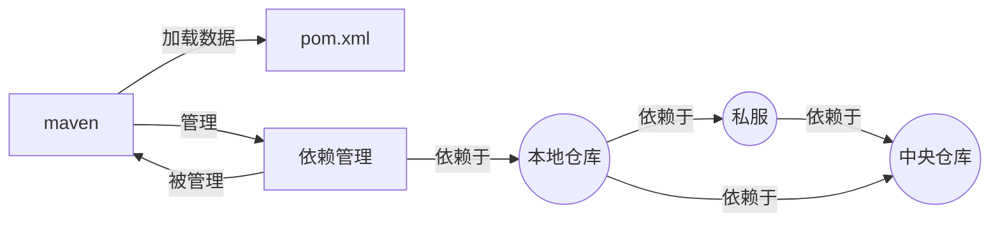
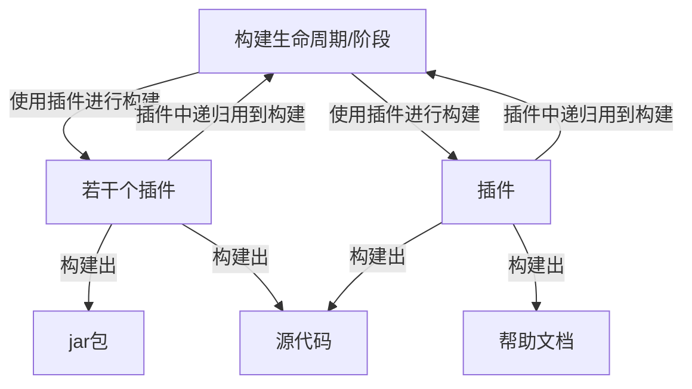
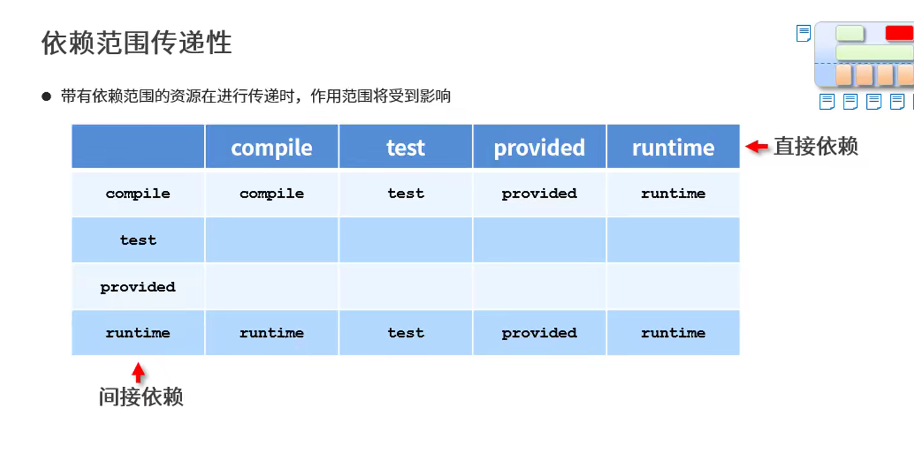
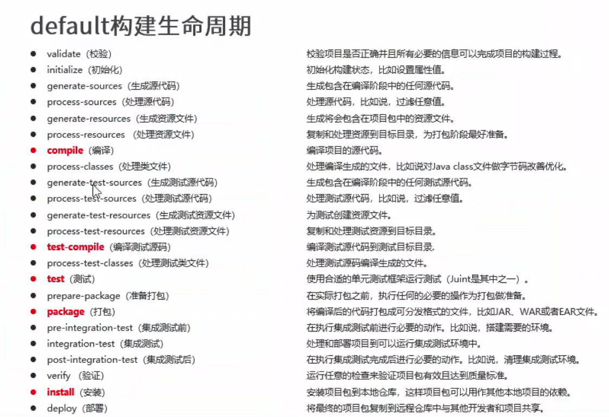
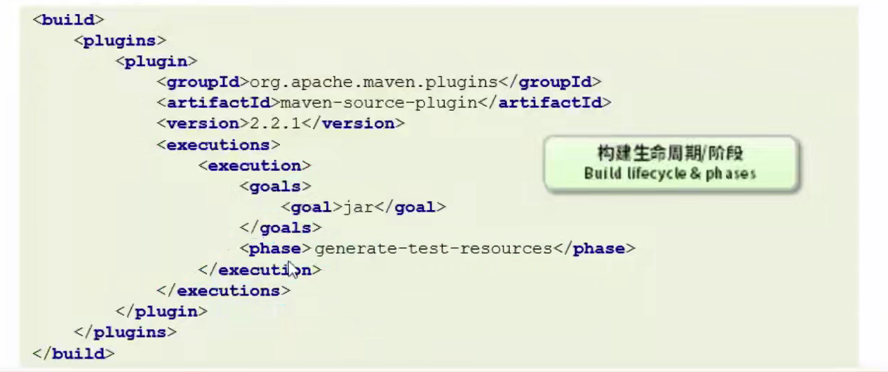
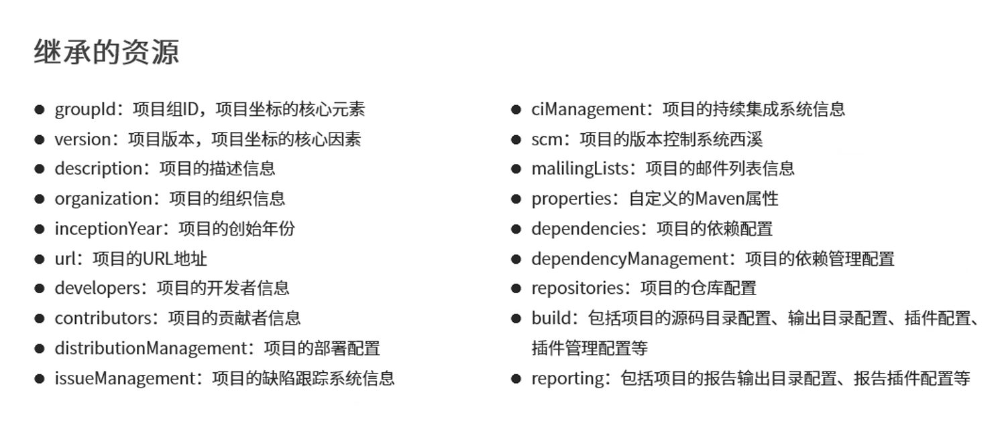
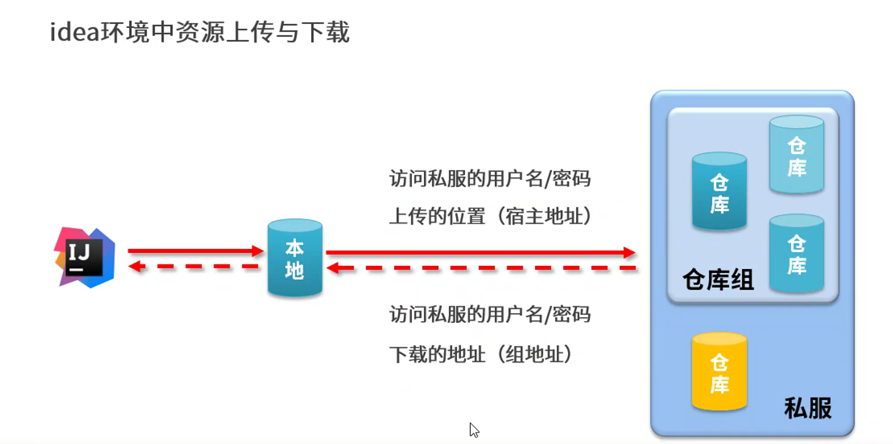

## 注：vscode中查看，笔记中graph的查看需要使用到Markdown Preview Enhanced插件，否则无法正确显示图示
## Maven基础
### Maven是什么
1. 解决点
    - jar包不统一，jar包不兼容
    - 工程升级维护过程操作繁琐
    - 等等。。。
2. 怎么解决
    - 项目构建：提供标准的，跨平台的自动化项目构建方式。
    - 依赖管理：方便快捷的管理项目依赖的资源(jar包)，避免资源间的版本冲突问题。
    - 统一开发结构：提供标准的、统一的项目结构。

3. Maven是什么
    - Maven的本质是一个项目管理工具，将项目开发和管理过程抽象成一个项目对象(POM)
    - POM(Project Object Model) : 项目对象模型
    - 问题点：
        - 既然maven将项目看作一个对象，那么该对象的行为及属性是什么呢？
            - 项目是通过加载pom.xml文件进行初始化的。
            - 项目管理资源即依赖管理，当前项目可通过maven管理资源同时也可做为资源被别的项目管理
            - 对应概念中，数据maven的部分
              - 项目对象模型
              - 依赖管理
              - 构建生命周期/阶段
              - 插件
            - 以上如下图所示


### Maven安装
- 需要JAVA_HOME与MAVEN_HOME(有待验证直接配置path是否有影响)
#### Maven基础概念
- 仓库：用于存储资源，包含各种jar包。
- 仓库分类：
  - 本地仓库：自己电脑上存储资源的仓库，连接远程仓库获取资源
  - 远程仓库：非本机电脑上的仓库，为本地仓库提供资源
    - 中央仓库：Maven团队维护，存储所有资源的仓库
    - 私服：部门/工地范围内存储资源的仓库，从中央仓库获取资源
  - 私服的作用：
    - 保存具有版权的资源，包含够爱或自主研发的jar
      - 中央仓库中的jar都是开源的，不能存储具有版权的资源
    - 一定范围内共享资源，仅对内部开放，不对外共享
- 坐标
  - 什么是坐标
    - Maven中的坐标用于描述仓库中资源的位置
  - Maven坐标主要组成
    - groupId：定义当前Maven项目隶属组织名称(通常是域名反写)
    - artifactId：定义当前Maven项目名称(通常是模块名称)
    - version：定义当前项目版本号
    - packing(不属于Maven坐标，此处是了解)：定义该项目的打包方式
- Maven坐标的作用
  - 使用唯一标识，唯一性定位资源位置，同故宫该标识可以将资源的识别与下载工作交由机器完成
### Maven配置，见setting文件中
### 手动创建Maven项目
注意其目录结构-见code文件夹中demo
### 创建可以通过命令行指定模板进行自动创建目录结构及自动获取对应依赖
#### 参数例子
  - 创建工程
    mvn archetype:generate
        -DgroupId={project-packaging} // 当前项目指定的id
        -DartifactId={project-name} // 当前项目指定的项目名称
        -DarchetypeArtifactId={XXX} // 使用的模板id
        -DinteractiveMode=false // 是否需要和用户输入进行交互。如果为false，则会使用合理的默认值。默认为true。
### Maven依赖管理
- 依赖配置
  - 依赖引入格式
```
    <dependencies>
        <dependency>
            <groupId></groupId>
            <artifactId></artifactId>
            <version></version>
        </dependency>
    </dependencies>
```
- 依赖传递
  - 多个模块时,A模块需要用到B模块,则只需要A通过g a v引入B模块即可,此时B模块中用到的所有jar包都会被A模块所依赖,这就叫依赖传递
  - 当依赖传递冲突时的解决方案
    - 路径优先：当依赖中出现相同的资源时，层级越深优先级越低。
    - 声明优先：当资源在相同层级被依赖时，配置顺序靠前的覆盖配置顺序靠后的。
    - 特殊优先：当同级配置了相同资源的不同版本，后配置的覆盖先配置的。
- 可选依赖
  - 可选依赖指对外隐藏当前所依赖的资源--不透明
```
    <dependencies>
        <dependency>
            <groupId></groupId>
            <artifactId></artifactId>
            <version></version>
            <optional>true</optional>
        </dependency>
    </dependencies>
```
- 排除依赖
  - 排除依赖指主动断开依赖的资源，被排除的资源无需指定版本--不需要了
```
    <dependencies>
        <dependency>
            <groupId></groupId>
            <artifactId></artifactId>
            <version></version>
            <optional>true</optional>
            <exclusions>
              <exclusion>
                <groupId></groupId>
                <artifactId></artifactId>
              </exclusion>
            </exclusions>
        </dependency>
    </dependencies>
```
- 依赖范围
  - 依赖的jar默认情况可以在任何地方使用，但是可以通过scope标签设置其作用范围
  - 作用范围详解
    - 主程序有效范围(main文件夹)：A
    - 测试程序有效范围(test文件夹)：B
    - 是否参与打包(package指令范围)：C
  - compile
    - 有效范围：ABC
  - provided
    - 有效范围：AB
  - runtime
    - 有效范围：C
  - system
    - 有效范围：
  - test
    - 有效范围：B
```
    <dependencies>
        <dependency>
            <groupId></groupId>
            <artifactId></artifactId>
            <version></version>
            <scope></scope>
        </dependency>
    </dependencies>
```
  -  依赖范围的传递性
     -  带有依赖范围的资源在进行传递时，作用范围将会受到影响。
     -  

### 生命周期与插件
#### 项目构建生命周期

- Maven构建生命周期描述的是一次构建过程经历了多少个事件
- Maven对项目构建的生命周期划分为3套
  - clean：清理工作
  - default：核心工作，例如编译，测试，打包，部署等
  - site：产生报告，发布站点等
  - 详解
    - clean生命周期
      - pre-clean
        - 执行一些需要在clean之前完成的工作
      - clean
        - 移除所有在上一次构建生成的文件
      - post-clean
        - 执行一些需要在clean之后立刻完成的工作
    -  default生命周期，太多，直接上图
      -  
    - site生命周期
      - pre-site
      - site
      - post-site (执行一些在生成站点后立即完成的工作并且为部署做准备)
      - site-deploy
#### 插件
- 插件与生命周期内的阶段绑定，在执行到对应生命周期时执行对应的插件功能
- 默认maven在各个生命周期上绑定有预设的功能
- 通过插件可以自定义其他功能
- 使用phase标签指定当前插件作用阶段
- 

### 分模块开发与设计
- 一个项目可以拆分成很多的子模块，子模块分别打成jar包，jar包之间相互调用。
- 子模块只要遵循maven的格式准则即可。
### 聚合
- 即通过父模块统一进行构建管理
- 要解决的问题是：当模块间分开后，一次打包可能只会打包当前模块，我们需要一个模块，当编译该模块的时候，所有子模块统一编译。该模块就是父模块。
```
    <groupId>com.cyuxuan</groupId>
    <artifactId>test-1</artifactId>
    <version>1.0-SNAPSHOT</version>
    <!-- packaging指定该工程用于进行项目构建 -->
    <packaging>pom</packaging>

    <!-- 管理的工程列表 -->
    <modules>
      <!-- 具体的工程名称 -->
      <module>工程名称1</module>
      <module>工程名称2</module>
    </modules>
```

### 继承
- 统一管理依赖版本
- 父pom中写版本，子pom中不需要写版本，不写则是使用父pom中的版本，如果子pom自己指定版本则使用子pom的版本
- 父pom
```
<!-- 声明进行依赖管理 -->
<dependencyManagement>
  <dependencys>
    <dependency>
        <groupId>junit</groupId>
        <artifactId>junit</artifactId>
        <version>4.12</version>
    </dependency>
  </dependencys>
</dependencyManagement>
```
- 子pom
```
  <!-- 定义该工程的父工程 -->

  <dependencys>
    <dependency>
        <groupId>junit</groupId>
        <artifactId>junit</artifactId>
    </dependency>
  </dependencys>
```
- 可继承的资源
- 


### 属性
- 文件中定义一个属性，其它地方可以引用

```
    <properties>
        <project.build.sourceEncoding>UTF-8</project.build.sourceEncoding>
        <maven.compiler.source>1.8</maven.compiler.source>
        <maven.compiler.target>1.8</maven.compiler.target>
    </properties>


    // 使用时采用${}即可使用
    ${maven.compiler.target}
```

### 版本管理


### 资源加载属性值
- 在maven中配置的属性值可以应用带项目中其他配置文件中
```
    <build>
        <!--配置资源文件对应的信息-->
        <resources>
            <resource>
                <directory>${project.basedir}/src/main/resources</directory>
                <filtering>true</filtering>
            </resource>
        </resources>
        <!--配置测试资源文件对应的信息-->
        <testResources>
            <testResource>
                <directory>${project.basedir}/src/test/resources</directory>
                <filtering>true</filtering>
            </testResource>
        </testResources>
    </build>
```


### 多环境配置
- 在父pom中定义多环境
- install -P {环境名称}
```
    <!--创建多环境-->
    <profiles>
        <!--定义具体的环境：生产环境-->
        <profile>
            <!--定义环境对应的唯一名称-->
            <id>pro_env</id>
            <!--定义环境中换用的属性值-->
            <properties>
                <jdbc.url>jdbc:mysql://127.1.1.1:3306/ssm_db</jdbc.url>
            </properties>
            <!--设置默认启动-->
            <activation>
                <activeByDefault>true</activeByDefault>
            </activation>
        </profile>
        <!--定义具体的环境：开发环境-->
        <profile>
            <id>dep_env</id>
            <properties>
                <jdbc.url>jdbc:mysql://127.2.2.2:3306/ssm_db</jdbc.url>
            </properties>
        </profile>
    </profiles>
```


### 私服
- nexus服务器的使用
- 仓库分类与手动上传组件
  - 仓库分类
    - 宿主仓库hosted
      - 保存无法从中央仓库获取的资源
        - 自主研发
        - 第三方非开源项目
  - 代理仓库proxy
    - 代理远程仓库，通过nexus访问其他公共仓库，例如中央仓库
  - 仓库组group
    - 将若干个仓库组成一个群组，简化配置
    - 仓库组不能保存资源，属于设计型仓库
  - 本地访问私服
    - 
    - 本地配置-maven的配置
```
<servers>
	<server>
		<id>demo-release</id>
		<username>admin</username>
		<password>admin</password>
	</server>
	<server>
		<id>demo-snapshots</id>
		<username>admin</username>
		<password>admin</password>
	</server>
</servers>


  <mirrors>
      <mirror>
          <id>nexus-aliyun</id>
          <mirrorOf>central</mirrorOf>
          <name>Nexus aliyun</name>
          <url>http://maven.aliyun.com/nexus/content/groups/public</url>
      </mirror>
      <mirror>
          <id>nexus-demo</id>
          <mirrorOf>*</mirrorOf>
          <url>http://localhost:8081/repository/maven-public/</url>
      </mirror>
  </mirrors>
```
  - 发布管理
```
    <!--发布配置管理-->
    <distributionManagement>
        <repository>
            <id>demo-release</id>
            <url>http://localhost:8081/repository/demo-release/</url>
        </repository>
        <snapshotRepository>
            <id>demo-snapshots</id>
            <url>http://localhost:8081/repository/demo-snapshots/</url>
        </snapshotRepository>
    </distributionManagement>
```