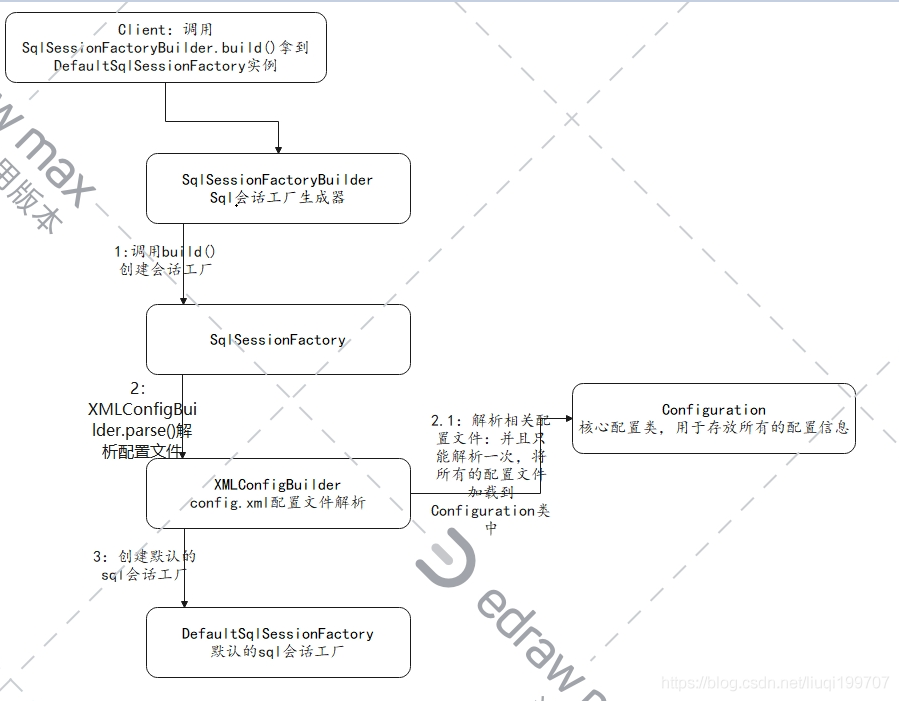
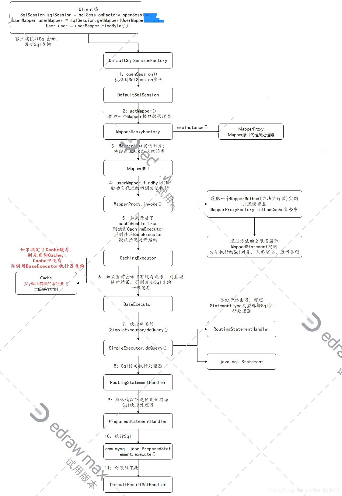

# 首先思考一个问题
## 原生的JDBC怎么执行一次完整的数据连接的

```java
        //将要执行的sql语句
        String sql = "SELECT * FROM bee_mybatis WHERE id = ?";
        // 1. 加载驱动
        // 关于该方式，是执行类加载来注册驱动 com.mysql.cj.jdbc.Driver 该类中的静态代码块执行注册
        Class.forName(className);
        // 2. 连接数据库
        Connection connection = DriverManager.getConnection(url, username, password);
        // 3. 创建预编译数据库操纵操作对象
        PreparedStatement preparedStatement = connection.prepareStatement(sql);
        // 4. 设置占位符的值
        preparedStatement.setInt(1, 1);
        // 5. 获取结果集
        ResultSet resultSet = preparedStatement.executeQuery();
        // 创建数据库操作对象
//        Statement statement = connection.createStatement();
//        ResultSet resultSet = statement.executeQuery(sql);
        while (resultSet.next()) {
            System.out.println(resultSet.getInt("id"));
        }
        resultSet.close();
//        statement.close();
        preparedStatement.close();
        connection.close();
```

## 这样做有什么问题？
1. 连接驱动完全是重复代码
2. 结果获取手动执行
3. sql与代码耦合

## mybatis的改进
1. 封装了所有的JDBC代码，将sql语句与执行代码解耦
2. 同时返回结果集只需要调用然后获取即可

## 流程图-来源(https://blog.csdn.net/liuqi199707/article/details/109712299)
1. 
2. 
- 注：mybatis使用例子查看https://github.com/cyuxuan/learn-java-source/tree/main/bee-code-test-field/mybatis-test-field，mybatis源码注释https://github.com/cyuxuan/learn-java-source/tree/main/mybatis/mybatis-3
- 后续代码注释中 (link step xxx)便是当前代码详细解释在xxx步骤中 


## mybatis的执行流程(通过xml模式，源码有注释)
###### 1. 获取mybatis配置文件文件输入流 inputStream
```java
    String resource = "mybatis-config.xml";
    InputStream inputStream = Resources.getResourceAsStream(resource);
```
---
###### 2. 实例化SqlSessionFactoryBuilder用于获取SqlSessionFactory,并调用 build(inputStream) 函数获取 SqlSessionFactory
```java
    SqlSessionFactory sqlSessionFactory = new SqlSessionFactoryBuilder().build(inputStream);
```

```java
  public SqlSessionFactory build(InputStream inputStream, String environment, Properties properties) {
    try {
      // 获取配置，link step 3.1
      XMLConfigBuilder parser = new XMLConfigBuilder(inputStream, environment, properties);
      // 生成SqlSessionFactory
      // 此处调用解析后的数据 parse进行解析，[link step ]
      return build(parser.parse());
    } catch (Exception e) {
      throw ExceptionFactory.wrapException("Error building SqlSession.", e);
    } finally {
      ErrorContext.instance().reset();
      try {
      	if (inputStream != null) {
      	  inputStream.close();
      	}
      } catch (IOException e) {
        // Intentionally ignore. Prefer previous error.
      }
    }
  }
```

```java
  public SqlSessionFactory build(Configuration config) {
    return new DefaultSqlSessionFactory(config);
  }
```

###### 2.1 实例化一个 XMLConfigBuilder 用于获取配置文件,前提需要一个 XPathParser 对象(2.2)
```java
  /**
   * 通过输入流，获取配置信息
   *
   * @param inputStream 配置文件输入流
   * @param environment 环境信息，默认是null
   * @param props       键值对信息，默认是null，暂时没有确认用途
   */
  public XMLConfigBuilder(InputStream inputStream, String environment, Properties props) {
    // XPathParser [link step 2.1.1]
    this(new XPathParser(inputStream, true, props, new XMLMapperEntityResolver()), environment, props);
  }
```

###### 2.1.1 实例化一个 XPathParser 对象，该对象用于解析文件中配置信息
```java
  /**
   * 构造函数
   *
   * @param inputStream    配置文件输入流
   * @param validation     获取document时是否要开启校验，开启校验的话会根据xml配置文件中定义的dtd文件校验xml格式，默认不开启校验
   * @param variables      mybatis-config.xml配置文件中，<Properties>节点引入或定义的属性
   * @param entityResolver 实体解析器，用于从本地工程目录中引入dtd文件，而不是根据网络URL去加载校验文件
   */
  public XPathParser(InputStream inputStream, boolean validation, Properties variables, EntityResolver entityResolver) {
    // 初始化一些公共参数
    commonConstructor(validation, variables, entityResolver);
    // 解析出document对象，以DTD文件解析，使用的就是传入的entityResolver
    this.document = createDocument(new InputSource(inputStream));
  }
```
```java
  /**
   * 公共参数的初始化
   *
   * @param validation     是否根据dtd校验数据
   * @param variables      mapper文件中属性标签的值
   * @param entityResolver 实体解析器，用于从本地加载DTD文件
   */
  private void commonConstructor(boolean validation, Properties variables, EntityResolver entityResolver) {
    this.validation = validation;
    // 这里的实体解析器，用于document文件解析中使用
    this.entityResolver = entityResolver;
    this.variables = variables;
    XPathFactory factory = XPathFactory.newInstance();
    this.xpath = factory.newXPath();
  }
```
---
###### 2.1.2 使用parse进行数据解析，获取一个Configuration对象，用于构建一个SqlSessionFactory
```java
  /**
   * 执行数据解析
   *
   * @return 返回一个配置类对象
   */
  public Configuration parse() {
    // 标记是否已经解析过，全局只解析一次
    if (parsed) {
      throw new BuilderException("Each XMLConfigBuilder can only be used once.");
    }
    parsed = true;
    // 执行解析，并赋予根节点
    parseConfiguration(parser.evalNode("/configuration"));
    return configuration;
  }
```
```java
  /**
   * 执行配置解析,初步分析,该部分是按名字进行解析,然后进行设置值
   *
   * @param root 根节点
   */
  private void parseConfiguration(XNode root) {
    try {
      // issue #117 read properties first
      propertiesElement(root.evalNode("properties"));
      Properties settings = settingsAsProperties(root.evalNode("settings"));
      loadCustomVfs(settings);
      loadCustomLogImpl(settings);
      typeAliasesElement(root.evalNode("typeAliases"));
      pluginElement(root.evalNode("plugins"));
      objectFactoryElement(root.evalNode("objectFactory"));
      objectWrapperFactoryElement(root.evalNode("objectWrapperFactory"));
      reflectorFactoryElement(root.evalNode("reflectorFactory"));
      settingsElement(settings);
      // read it after objectFactory and objectWrapperFactory issue #631
      environmentsElement(root.evalNode("environments"));
      databaseIdProviderElement(root.evalNode("databaseIdProvider"));
      typeHandlerElement(root.evalNode("typeHandlers"));
      mapperElement(root.evalNode("mappers"));
    } catch (Exception e) {
      throw new BuilderException("Error parsing SQL Mapper Configuration. Cause: " + e, e);
    }
  }
```
---
###### 3. 至此，sqlSessionFactory完成初始化
---
###### 4. 获取 SqlSession
```java
    // 获取Sql连接对象
    SqlSession session = sqlSessionFactory.openSession()
```

```java
    /**
    * 按照默认方式打开SqlSession
    *
    * @return SqlSession对象
    */
    @Override
    public SqlSession openSession() {
        // 默认execType SIMPLE
        return openSessionFromDataSource(configuration.getDefaultExecutorType(), null, false);
    }
```

```java
    /**
    * @param execType   执行类型{@link ExecutorType}对应来行已有注释
    * @param level      事务类型
    * @param autoCommit 是否自动提交
    * @return
    */
    private SqlSession openSessionFromDataSource(ExecutorType execType, TransactionIsolationLevel level, boolean autoCommit) {
        Transaction tx = null;
        try {
        // 获取环境信息
        final Environment environment = configuration.getEnvironment();
        // 获取事务工厂，如果配置文件中有事务则使用配置中的，否则创建一个新的(默认的)
        final TransactionFactory transactionFactory = getTransactionFactoryFromEnvironment(environment);
        // 创建事务对象
        tx = transactionFactory.newTransaction(environment.getDataSource(), level, autoCommit);
        // 获取sql执行器,通过不同条件获取不同的执行器
        final Executor executor = configuration.newExecutor(tx, execType);
        // 获取默认SqlSession
        return new DefaultSqlSession(configuration, executor, autoCommit);
        } catch (Exception e) {
        closeTransaction(tx); // may have fetched a connection so lets call close()
        throw ExceptionFactory.wrapException("Error opening session.  Cause: " + e, e);
        } finally {
        ErrorContext.instance().reset();
        }
    }
```
---  
###### 5. 获取MapperProxyFactory对象，默认使用DefaultSqlSession
```java
    /**
    * 获取Mapper对象
    *
    * @param type Mapper interface class
    * @param <T>  对应的Mapper对象接口类型
    * @return 返回一个被代理的可执行的Mapper对象
    */
    @Override
    public <T> T getMapper(Class<T> type) {
        return configuration.getMapper(type, this);
    }
```
```java
  public <T> T getMapper(Class<T> type, SqlSession sqlSession) {
    return mapperRegistry.getMapper(type, sqlSession);
  }
```
```java
    public <T> T getMapper(Class<T> type, SqlSession sqlSession) {
        return mapperRegistry.getMapper(type, sqlSession);
    }
```
```java
    /**
    * 获取一个对应interface的Mapper类
    * @param type 要获取的类型Class
    * @param sqlSession
    * @param <T> 指定的类型
    * @return 返回获取到的Mapper对象
    */
    @SuppressWarnings("unchecked")
    public <T> T getMapper(Class<T> type, SqlSession sqlSession) {
        // 从已知的Mapper中取出当前对应的Mapper生成工厂
        final MapperProxyFactory<T> mapperProxyFactory = (MapperProxyFactory<T>) knownMappers.get(type);
        if (mapperProxyFactory == null) {
        throw new BindingException("Type " + type + " is not known to the MapperRegistry.");
        }
        try {
        // 使用当前的Mapper生成工厂获取对应实例
        // link step 5
        return mapperProxyFactory.newInstance(sqlSession);
        } catch (Exception e) {
        throw new BindingException("Error getting mapper instance. Cause: " + e, e);
        }
    }
```

###### 6. 使用 MapperProxyFactory 生成一个被代理后的Mapper对象
```java
    public T newInstance(SqlSession sqlSession) {
        // 关于Mapper对象的代理请参看源码注释
        final MapperProxy<T> mapperProxy = new MapperProxy<>(sqlSession, mapperInterface, methodCache);
        return newInstance(mapperProxy);
    }
```

###### 7.执行Sql
```
    执行Sql是使用了被代理过后的Mapper对象，实际使用对应的Executor执行数据
    详情参考Executor的代理
```