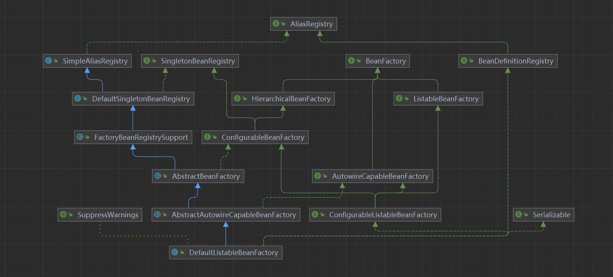
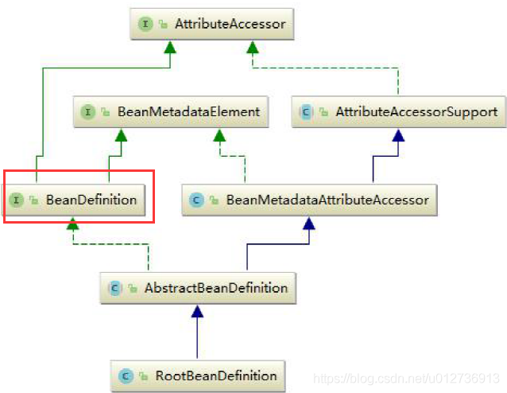
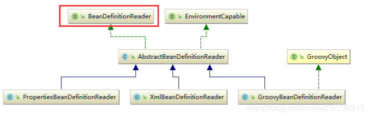
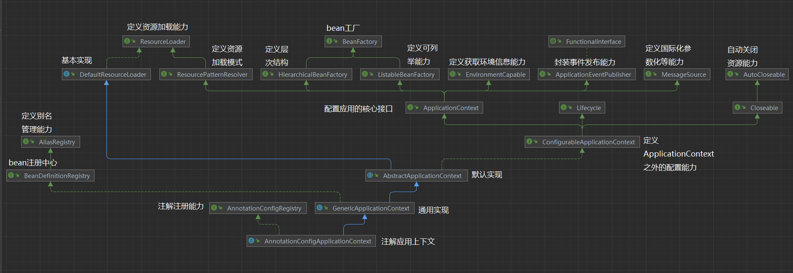
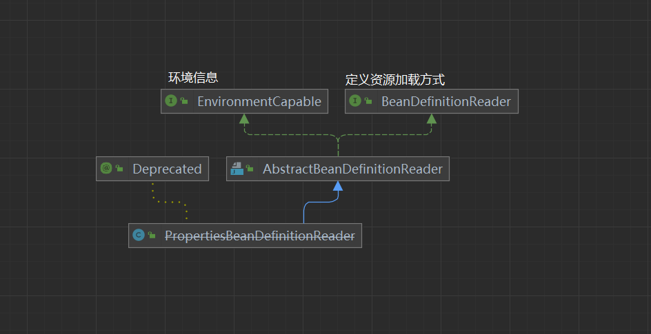
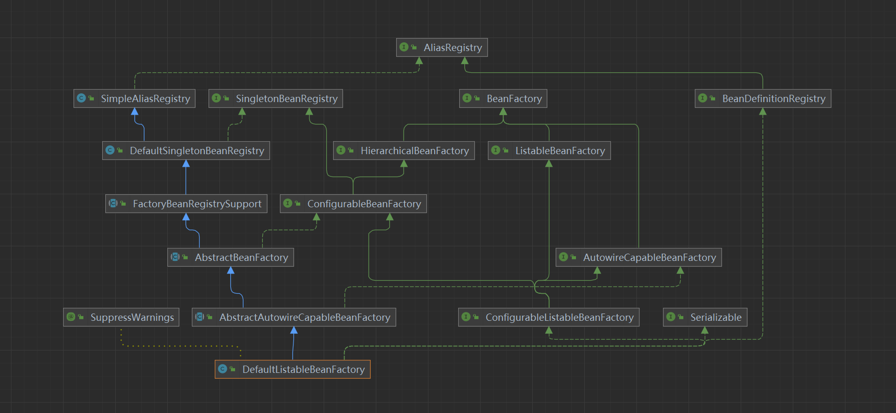

# Spring IOC
## Spring IOC核心UML

****
****
****

### BeanFactory

#### 1. 详细说明

  ##### 1. AliasRegistry
      - 定义别名管理能力，管理别名的公共接口，作为BeanDefinitionRegistry的超级接口
  ##### 2. SimpleAliasRegistry
      - AliasRegistry的简单实现
  ##### 3. SingletonBeanRegistry
      - 定义共享bean的注册中心
  ##### 4. BeanDefinitionRegistry
      - 定义Bean注册中心的能力，用于保存bean定义实例
  ##### 5. DefaultSingletonBeanRegistry 
      - 共享bean实例的通用注册中心，实现SingletonBeanRegistry接口，允许注册单例对象，这些单例对象对所有注册中心的调用者所共享，bean通过名称获得。
  ##### 6. FactoryBeanRegistrySupport
      - 支撑基类，用于需要持有BeanFactory实例的单例注册中心，并且集成了DefaultSingletonBeanRegistry的单例管理能力
  ##### 7. AbstractBeanFactory
      - BeanFactory的抽象基类，提供ConfigurableBeanFactory的所有能力，但它不是一个拥有列举能力的bean factor。可以用作从某些后端资源获取bean定义的bean工厂实现的基类
  ##### 8. BeanFactory接口
      - 定义一些IOC框架的基本行为与功能
  ##### 9. HierarchicalBeanFactory接口
      - 定义父容器的访问功能，默认的父容器即时BeanFactory
  ##### 10. ListableBeanFactory
      - 定义对bean容器中，bean的查找及枚举等功能
  ##### 11. AutowireCapableBeanFactory
      - 定义Bean的自动装配(autowiring)功能
  ##### 12. ConfigurableBeanFactory
      - 定义对BeanFactory的配置功能
  ##### 13. ConfigurableListableBeanFactory
      - 定义beanDefinition的解析,注册功能及单例实例预加载(解决循环依赖问题)
  ##### 14. AbstractAutowireCapableBeanFactory
      - 抽象bean工厂，提供一系列实例化RootBeanDefinition的所有属性及能力的功能
  ##### 15. DefaultListableBeanFactory
      - Spring提供的BeanFactory的唯一默认实现，基于BeanDefinition元数据，可以通过后处理器进行扩展(post-processors) 
[参考文档](https://www.jianshu.com/p/2854d8984dfc)

****
****
****

### BeanDefinition

- 一些说明
  - AttributeAccessor
    - 定义通用的契约，用从对象读取元数据或者附件元数据给对象
  - BeanMetadataElement
    - 由携带配置源对象的 bean元数据 元素实现
    - 定义返回此元数据元素的配置源Object功能
    - 待详细释义
  - AttributeAccessorSupport
    - 提供AttributeAccessor的方法的基本实现
    - 由子类提供扩展
  - BeanDefinition
    - 该接口用于描述一个bean实例，该实例有属性值，构造参数，及其它进一步的信息
  - BeanMetadataAttributeAccessor
    - AttributeAccessorSupport的扩展
  - AbstractBeanDefinition
    - BeanDefinition的基本实现类，提炼出GenericBeanDefinition，RootBeanDefinition，ChildBeanDefinition的公共子类

****
****
****

### BeanDefinitionReader

- 一些说明
  - BeanDefinitionReader
    - Bean定义读取器的简答接口，它定义带有Resource和String加载参数的加载函数
  - EnvironmentCapable
    - 标明一个用于暴露环境参数的组件
  - AbstractBeanDefinitionReader
    - BeanDefinitionReader的基本实现抽象类
  - GroovyObject
    - GroovyScriptFactory使用的策略，它允许对已创建的GroovyObject进行定制
  - PropertiesBeanDefinitionReader
    - 读取简单属性格式的bean信息
  - XmlBeanDefinitionReader
    - 读取XML格式的Bean
  - GroovyBeanDefinitionReader
    - 读取Groovy格式的Bean信息

****
****
****

### 理解其中一个ApplicationContext
#### UML

#### 一些说明
  ##### 1. ResourceLoader
      - 加载资源的策略接口，ApplicationContext必须要提供该接口定义的功能
  ##### 2. DefaultResourceLoader
      - ResourceLoader的默认实现
  ##### 3. ResourcePatternResolver
      - 定义Resource对象加载模式的策略接口
  ##### 4. HierarchicalBeanFactory
      - 定义层级结构能力，由拥有层级结构的那些bean工厂实现。

****
****
****
### PropertiesBeanDefinitionReader

#### 一些说明
##### EnvironmentCapable
- 定义环境信息获取能力
##### BeanDefinitionReader
- 定义资源加载方法，这些方法带有Resource或者String参数类定位资源
##### AbstractBeanDefinitionReader
- 参考代码 springframework-AbstractBeanDefinitionReader
##### PropertiesBeanDefinitionReader
- 参考代码 springframework-PropertiesBeanDefinitionReader

****
****
****
### DefaultListableBeanFactory
