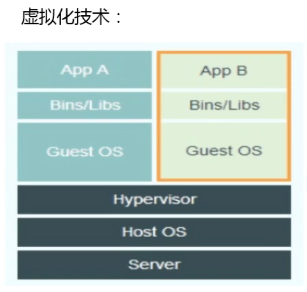
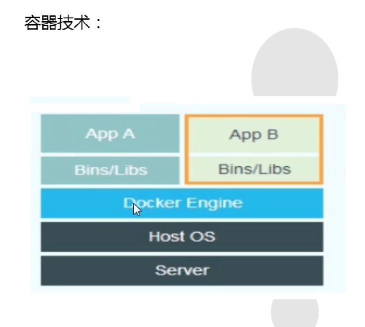

# 笔记来源:(教学资源)(https://www.bilibili.com/video/BV1nr4y1T7Bf?p=2&spm_id_from=pageDriver)
# 推荐观看笔记(https://www.yuque.com/grep/kubernetes)
# Docker&K8S
## Docker
### 第一章 容器技术概述
#### 容器是什么？
- 容器是一种基础工具。泛指任何可以用于容纳其它物品的工具，可以部分或者完全封闭，被用于容纳，储存，运输物品。物体可以被放置在容器中，而容器则可以保护内容物。
- 业务需求
  - 我们需要同一台机器上的不同进程跑在不同的运行时环境中。
    - 关于该业务场景已经有虚拟化技术完美解决该问题
    - 
    - 该技术存在的问题：开销太大-需要安装来宾操作系统-虚拟机对资源消耗太大
    - 所以出现了容器技术
    - 
    - 使用容器技术极大的避免了开销，首先就避免了安装来宾操作系统。
- 应用隔离
  - 应用之间的隔离是通过NameSpace隔离实现的(资源隔离)
  - 需要隔离的最小维度(内核版本指该隔离技术实现的Linux内核版本)
    - PID(进程编号)-内核版本:2.6.24
    - NET(网络设备、网络协议栈、端口等)-内核版本:2.6.29
    - IPC(信号量、消息队列、共享内存)-内核版本:2.6.19
    - MOUNT(文件系统，挂载点)-内核版本:2.4.19
    - UTS(主机名和主机域)-内核版本:2.6.19
    - USER(操作进程的用户和用户组)-内核版本:3.8.x
- 容器技术简史
1. 1979年 - chroot
   - 该技术是文件系统的隔离，chroot 可以重定向进程及其子进程的 root 目录到文件系统上的新位置，也就是说使用它可以分离每个进程的文件访问权限，使得该进程无法接触到外面的文件
2. 2000年 - FreeBSD Jals
   - FreeBSD Jails是FreeBSD平台上的一种基于容器的虚拟化技术，是对Unix传统的chroot机制的一种扩展使应用程序在不同层次不同维度空间内独立运行。
3. 2004年 - Solaris Containers
   - [简介](https://www.cnblogs.com/lisperl/archive/2012/05/07/2487367.html)
4. 2005年 - OpenV2
   - [简介](https://baike.baidu.com/item/OpenVZ/3270542)
5. 2007年 - cgroups
   - [简介](https://baike.baidu.com/item/cgroup/4988200)
6. 2008年 - LXC(Linux Containers)
   - 该组件具有划时代意义,基本实现上述六个维度的隔离，开启了容器时代
   - 简介-暂缺
7. 2013年 - Docker
   - 简介
   - Build Once, Run Anywhere -- Solomon Hykes
8. 2014年 - Rocket
   - 算是失败了
9.  2016年 - Windows Containers
    - 暂缺
10. k8s微服务
    - 暂缺
#### Docker简介
- 简介
  - Docker是基于容器技术的轻量级虚拟化解决方案
  - Docker是容器引擎，吧Linux的cgroup、namespace等容器底层技术进行封装抽象为用户提供了创建和管理容器的边界界面(包括命令行和API)
  - Docker是一个开源项目，诞生于2013年初，基于Coogle公司推出的Go语言实现。
  - 微软，红帽Linux，IBM，Oracle等主流IT厂商在自己的产品里增加对Dockers的支持。
  - 相比其它早期的容器技术，Docker引入了一整套完整容器管理的生态系统，包括分层的镜像模型，容器注册库，友好的Rest API。
  - 
  - 
#### Docker的安装
- 安装
  1. 检查Linux内核版本
    - uanme -a
    - 检查当前linux内核版本，3.8版本以上(参看前面的应用隔离实现版本)
  2. 防火墙设置开启需要的端口
  3. 安装epel源 - 按需安装
    - [简介](https://www.cnblogs.com/fps2tao/p/7580188.html)
    - 指令: yum install epel-release -y
  4. 安装yum-utils
    - 指令: yum install -y yum-utils
    - 